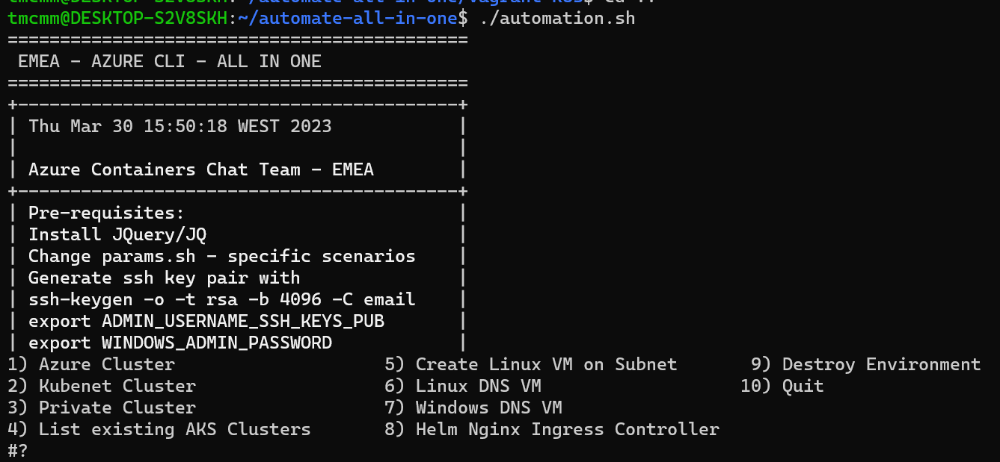

# EMEA Container Chat - Automation Bash Script all in one

This is a compilation of multiple scripts in a single one that can be used on a daily basis for creating most of the customer basic scenarios.
You can alter the params.sh file according to each scenario depending on the requirement.

## Setup Environment

### Install jQuery locally
```
sudo apt update
sudo apt install libjs-jquery
```
### Generate ssh key pair
```
sudo apt install openssh-client
ssh-keygen -o -t rsa -b 4096 -C "email@microsoft.com"
```

### Export the necessary sensitive variables
You can export the variables or put them under your bash_profile file.
```
export ADMIN_USERNAME_SSH_KEYS_PUB
export WINDOWS_ADMIN_PASSWORD
```

### Alias for az-cli as docker image 
```
Put the following under /home/user/.bashrc
function az () { docker run -i --rm -u `id -u`:`id -g` -v $HOME:$HOME -v /tmp:/tmp -v `echo "/$(echo "$PWD" | cut -d "/" -f2)"`:`echo "/$(echo "$PWD" | cut -d "/" -f2)"`  -w $PWD -e HOME=$HOME mcr.microsoft.com/azure-cli "$@"; }
export -f az
```
### Run the 
